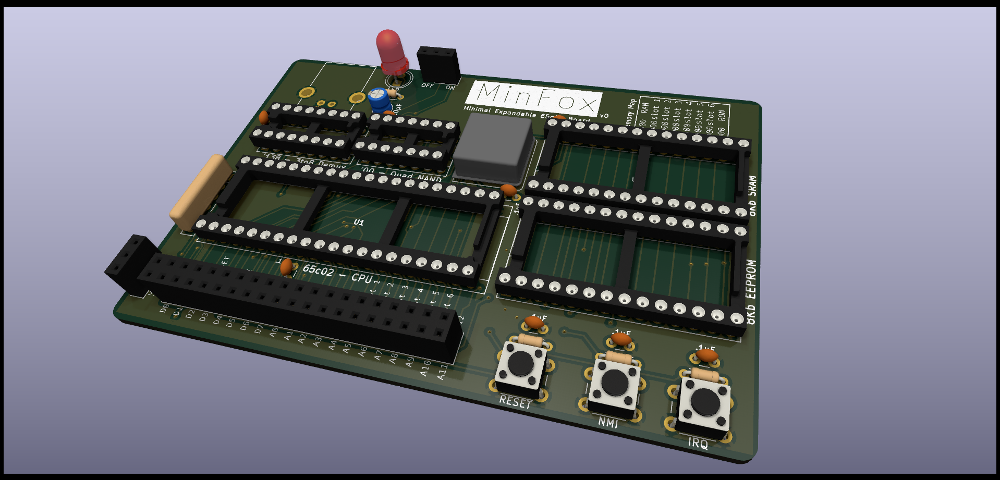

# GENERAL WARNING

These are various kicad projects developed over the course of this project, before taking a look at these it is extremely important that you understand the following:

* These projects are largely untested
* These projects were designed by a very clueless self-taught hobbyist
* I do not recommend using any of these for any purpose without scrutiny

## The projects

### 40key BreadKeys

A 40% mechanical keyboard matrix (8x5) designed to be hooked up to a breadboard via DuPont jumpers.

### MinFox 

A minimal expandable 65c02 sbc built for debugging peripherals, it contains ROM, RAM and 6 "slot select" lines (same terminology as the Fennec) that allow easily adding expansion chips without extra hardress decoding logic.

